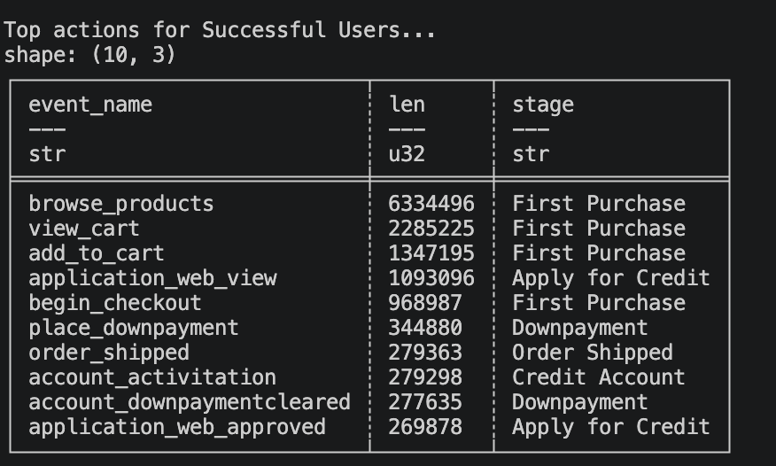
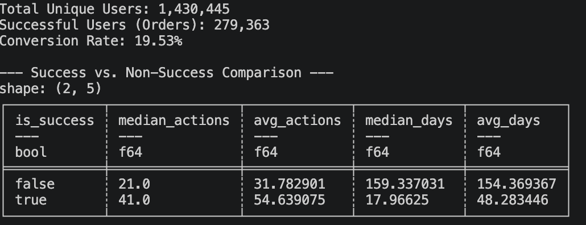
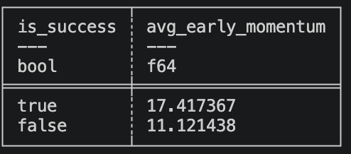

# Assignment 1: Group 4
## Derek Shi, Caoimhe (Queeva) Curran, Jayden Tani, Emilio Dulay

# TASK 1: Summarize Complete Journeys
A "Success" is defined as any journey containing at least one **order_shipped** event (Event ID: 28), and an unsuccessful for one more than 60 days with inactivity. Success represents **19.53%** (279,363 users) of the total population.

The following results highlight the difference in actions and days between users who convert and those who do not.

From this last plot, we hypothesize that successful cases have "high momentum", we define this as the amount of action in the first day of the journey.

# TASK 2: 
In this dataset, "Incomplete" (Unsuccessful) journeys are defined by a lack of action for 60 days, whereas "Successful" journeys end with an order_shipped event. However, a "completed" successful journey is often much shorter in duration than the 60-day threshold required to declare a failure.

To create a fair comparison and avoid a look-ahead Bias (predicting the past using future information), we implemented two specific strategies: **Proportional Weighting and Random Truncation**.

Successful journeys in our data have a median duration of 18 days, while unsuccessful journeys linger for a median of 159 days.

In a real-world environment, we are much more likely to "catch" a long journey in progress than a short one. Logically, a user in a 100 day journey is 100 times more likely to be int he testing set than a use rin a single day journey.

To ensure our training data reflects this "Testing Distribution," we did not sample users uniformly. Instead we create a feature called sampling_weight, which will create "importance" for longer journeys in our machine learning model. 

Finally, we apply the Random Truncation, to simulate the random ability to be caught in th emiddle of a journey, rather than including the successful actions itself.

# Task 3:

