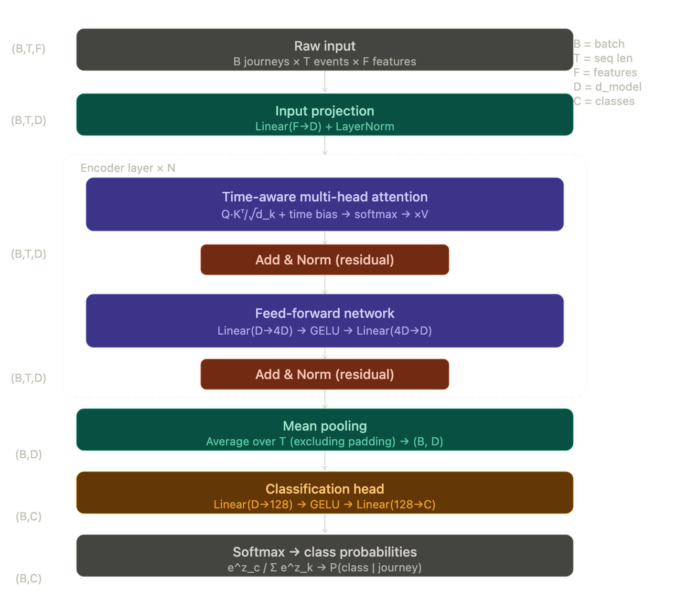

# Next Steps:
1. Create a Hybrid Architecture:
    - 1-Layer CNN at the start (before the Transformer) in order to catch slopes and spikes rather than points- reduce noise
2. Handle class imbalance by penalizing the model for missing the rarer class (in this case, success)
    - code: # If failures are 10x rarer than successes
            weights = torch.tensor([10.0]).to(device)
            criterion = CrossEntropyLoss(weight=weights)
3. Different types of encoding:
    - Sinisuoidal (current implementation): is designed for text data
    - Learnable Positional Encoding:
    - Relative Positional Encoding: Tells the model how far a given step is away from the next step. 
        - This is useful for when journeys are varying lengths. (which is the case for our data)
        - Modifies the Attention Mechanism itself by calculating the distance between relative steps
        

# Time-aware Encoding:

## Corresponding Steps Based on the Diagram

### Section 1: Raw Data -> basic encoding
- The input shape of raw data is defined by (B, T, F)
    - B is the number of journeys
    - T is the time steps
    - F are the features
    - This means that a single cell of the tensor represents a particular feature at a particular time step of a particular journey
- We want to project this raw data into a 'richer' dimensional space. This is the early step to the encoding. The linear projection is represetned as : z = x * Wt + b, where z is interrpreted as a learned weighted combination of input features
- We apply LayerNorm to these linear combinations in order to normalize each token. This effectively prevents early layers in future steps from producing scaled activations which destabilize training

### Section 2 -> Time-aware multi-head attention
- Step 2a: QKV Projections
    - For each head (h), the input now with the shape B, T, D is projected three ways.
        Q = x * W_Q -> What am I looking for
        K = x * W_K -> What do I offer
        V = x * W_V -> What do I actually mean
- Step 2b: Scaled dot-product
    - Scaling the dot-product prevents high dimensional vectors from 'over-saturating' regions where gradients are near zero
- Step 2c: Time-relative bias
    - dt[i,j]   = t_i − t_j                 (Time diff in seconds)
    - dt̃[i,j]   = sign(dt) × log1p(|dt|)    (log-compressed)
    - B_h[i,j]  = MLP_h(dt̃[i,j])            (shape: B,h,T,T)
    - Ã         = A + B                     (biased scores)
- Step 2d: Softmax bias scores (α)
    - Softmax in order to make sure that the scores fit the rules of a probability distribution
    - Values that are -inf are padded to 0 in order to contribute 0 weight to over dist
    - α[i, :] = softmax(Ã[i, :]) 
- Step 2e: Weighted sum of values
    - head_h = α · V      shape: (B, h, T, d_k)
    - apply the softmax-bias scores to corresponding value matrix
- Step 2f: Concatenate + output projects
    - Concatenate each weights sum of values
    - output is product of concat vector and W0

### Stage 3: Residual connection + Layer Norm
- we add the output from attention with the original input
- this creates a residual connection (difference between input and output)
- this prevents the vanishing gradient problem. Without the residual connection, the gradient collapses towards 0 as the number of layers grows

### Stage 4: Feed-forward NN
- attention is used to mix information across positions (cross-attention)
- FFN used to process each position independently
- FFN acts a form of key-value memory (different neurons activate for different patterns of input)
- GELU is used to address nonlinearity: 
    - For large positive x -> stays x
    - For large negative x -> x goes to 0
    - GELU smooths dist near 0

### Stage 5: Mean Pooling
- After all the encoding/attention steps we are left with a Tensor shaped (B, T, D) ie contextual representation for every time step
- in order to turn create classifications, we need to turn the tensor into a single vector. 
- h̄ = (1 / |real|) × Σⱼ  xⱼ · 1[j is not padding]
- Note: 'real' is the number of positions that are not padded (ie 0)

### Stage 6: Classification 
- Mean-pooled vector is shape (B, D) 
- This is passed through two-layer MLP producing C logits
- z₁ = GELU( h̄ · W₁ + b₁ )     shape: (B, 128)
- z₂ = z₁ · W₂ + b₂         shape: (B, C)    ← raw logits
- P(class c | journey) = e^{z_c} / Σₖ e^{z_k}
- L = − Σᵢ  yᵢ · log P(class i)

### Overall Equation Pipeline
Input:       x         ∈ ℝ^{T×F}

Embed:       e = Norm(x · Wₑ)               ∈ ℝ^{T×D}

Encode:      For layer l = 1…N:
               a = e + Attention(Norm(e), timestamps)
               e = a + FFN(Norm(a))          ∈ ℝ^{T×D}

Pool:        h̄ = (1/|real|) Σⱼ eⱼ           ∈ ℝ^D

Classify:    z = W₂ · GELU(W₁ · h̄ + b₁) + b₂   ∈ ℝ^C

Predict:     ŷ = argmax softmax(z)

Train:       L = −log P(true class)